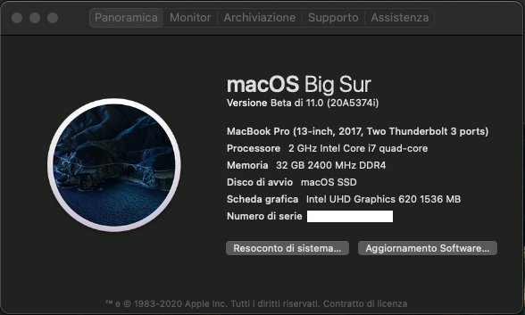
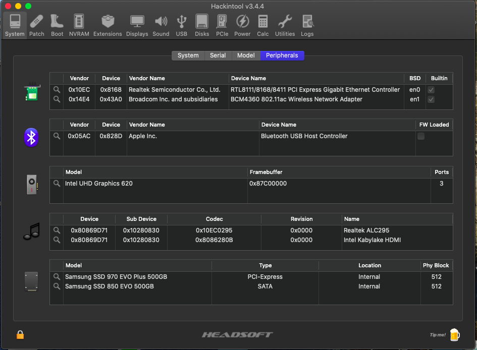
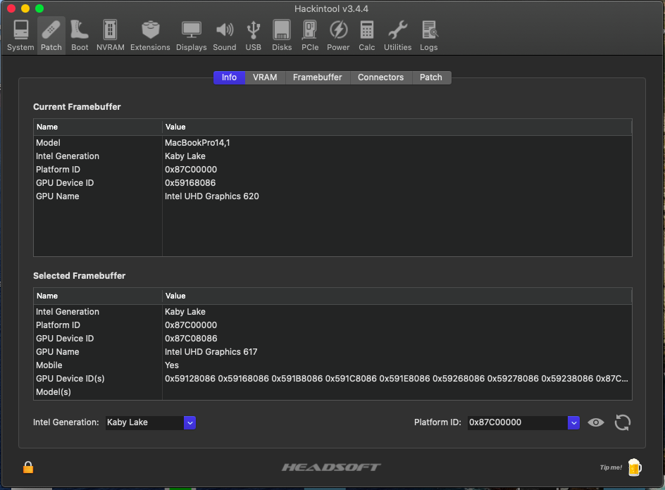
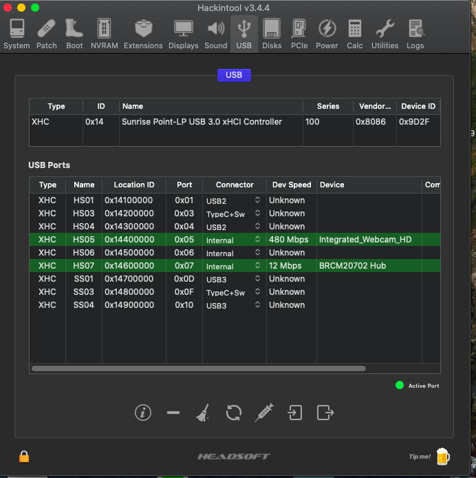
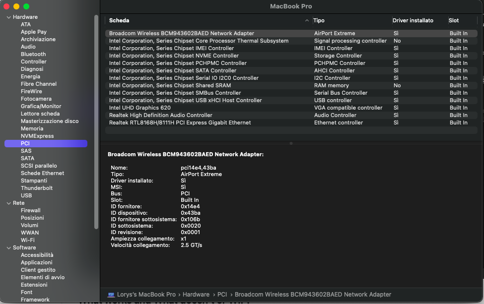
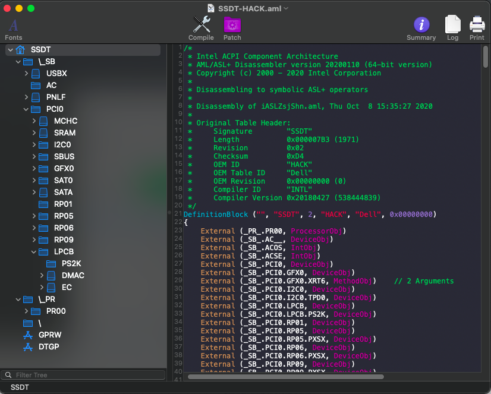

# Dell Vostro 5471 Hackintosh (Basic EFI)

EFI for Dell Vostro 5471 with OpenCore bootloader

### Computer Spec:

| Component        | Brank                              |
| ---------------- | ---------------------------------- |
| CPU              | Intel® i7 8550U (KBL-R)            |
| iGPU             | Intel® UHD Graphics 620            |
| dGPU             | AMD Radeon 530 (disabled on macOs) |
| Display          | 14" FHD 1920x1080                  |
| Audio            | Realtek ALC295                     |
| Ram              | 32 Gb ddr4 2400 Mhz                |
| Lan              | Realtek 8168                       |
| Wifi + Bluetooth | BCM943602BAED (replaced)           |
| NVMe             | Samsung 970 EVO PLUS 500 GB        |
| SSD              | Samsung 850 EVO 500 GB             |
| SmBios           | MacbookPro 15,2                    |
| BootLoader       | OpenCore 0.6.1                     |

## Peripherals

### What works and What doesn't or WIP:

- [x] Intel UHD 620 iGPU eDP Output (with Backlight)
- [x] Intel UHD 620 iGPU HDMI Output
- [x] Intel UHD 620 iGPU Type-C to HDMI Output
- [x] ALC295 Internal Speakers
- [x] ALC295 Native Combojack headphones
- [x] ALC295 HDMI Audio Output
- [x] All USB Ports + SD reader
- [x] SpeedStep / Sleep / Wake
- [x] I2C Touchpad with gesture
- [x] Brightness Key
- [x] Wi-Fi and Bluetooth BCM943602BAED (DW1830) Module
- [x] Realtek RTL8168 LAN
- [x] USB Cardreader
- [x] ACPI Battery
- [x] NVRAM
- [x] Windows boot from OpenCore
- [ ] Fingerprint (unsupported)
- [ ] dGPU Amd 530 (unsupported)
- [ ] ALC295 Combojack microphone

### Special Config:

- Usb port mapping performed
- SSDT-Hack Essential patch
- Applied cosmetics PCI Dev

### Post Install:

Open terminal and run install.sh from PostInsall/ComboJackAlc295. After reboot insert jack and appears this image

### SSDT Info

See [ioreg](./ioregmacbook.ioreg) for more clarification

## Credits

- [Apple](https://apple.com) for macOS;
- [Acidanthera](https://github.com/acidanthera) for OpenCore and all the lovely hackintosh work.
- [Dortania](https://github.com/dortania) For their detailed guides.
- [Lorys89](https://github.com/Lorys89)
- [Hackintoshlifeit](https://github.com/Hackintoshlifeit)

# If you need help please contact us on [Telegram](https://t.me/HackintoshLife_it) or [Web](https://www.hackintoshlife.it/)
